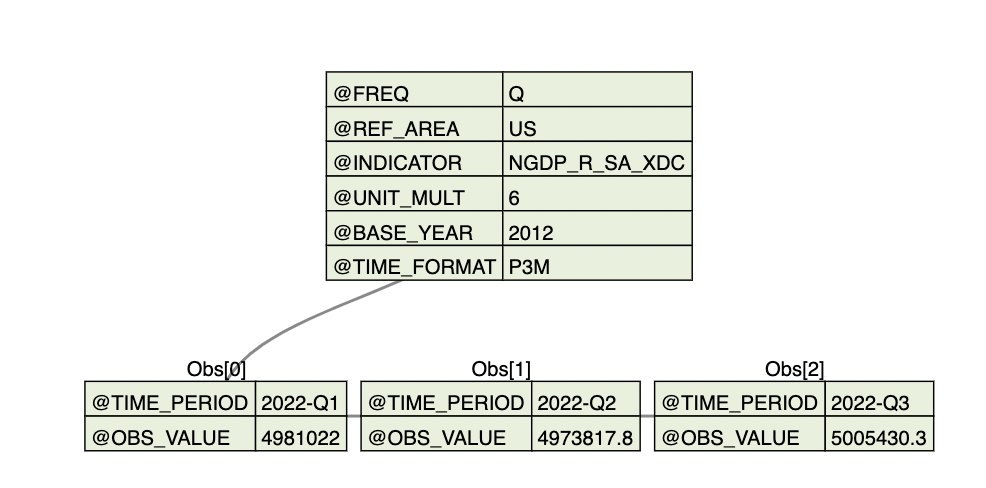

# Summary

The IMF's RESTful APIs for retrieving international economic
data series are technically involved. The structure of the
returned JSON datasets varies from one series to another. It
is too complex for an unprepared or non-technical user to
download or use the data.

We have created an installable Python package,
**IMFDataPy**, for discovering and extracting IMF data
series. It serves to mask or wrap the complexities of the
IMF JSON RESTful API so that the users would not need to
handle JSON data or its underlying metadata. It provides an
intuitive way for users to search through the series or indicator
names.

**IMFDataPy** is designed with an extensible software
architecture and simple APIs. It contains comprehensive and
searchable documentation; as well as unit tests that ensure
the functionality of the package as designed. The package
also contains robust input parsing; provides summaries of
the downloaded IMF time series data and metadata; and last
but not least, gives a number of economic and financial use
cases of **IMFDataPy**.

The current work is released as a Python package on Python
Package Index, [[**IMFDataPy** PyPI page]{.underline}](https://pypi.org/project/imfdatapy/) and
the source code is available at the GitHub repository,
[[**IMFDataPy** GitHub page]{.underline}](https://github.com/Economic-and-Financial-Data-Discovery/IMFDataPy).

# Statement of need

## Overview

The International Monetary Fund (IMF) is an international
organization that provides financial assistance and advice
to its 190 member countries out of 195 countries in the
world. Apart from advising services, the IMF periodically
collects large amounts of data on various economic indices
from its member countries.

An IMF data **series** (e.g., International Financial
Statistics) is a dataset containing multiple economic
indicators. An economic **indicator** (e.g., Gross Domestic
Product) is a set of time-indexed numeric values that
represents an economic index or metric. **Dimension** refers
to the metadata that pertains to all indicators within a
specific IMF series. Here, metadata is defined as a
collection of information that provides descriptive and
structural details about the data itself. The dimension most
commonly include the following items:

-   Area (e.g., the US) --- or in some datasets called Country ---
may refer to a territorial entity of a state understood by
international law, a territorial group (e.g., Eurozone), or
a non-sovereign territory for which statistics are
maintained;

-   Frequency (e.g., quarterly);

-   Period (e.g., from 2020 to 2022).


Table 1 lists some of the more than 30 monthly, quarterly, or
annual data series for 190 member countries from the 1960's to
present available from IMF [@imf_datasets].

--------------------------------------------------------------------------------
**Series** **Series Name**      **Examples of Indicators**
---------- -------------------- ------------------------------------------------
IFS        International        Gross Domestic Product,
           Financial            Interest Rates, Unemployment
           Statistics           Rates,
                                Consumer Price Index,
                                Industrial Production, Exchange
                                Rates,
                                Export and Import, Government
                                Revenues and Expenditures

GFS        Government           Financial assets and
           Finance              liabilities classified by
           Statistics           sector, Government Revenue, Government
                                Cash Flow

HPDD       Historical           Debt To GDP Ratio
           Public Debt
           Database

PCPS       Primary              Indices of market price for
           Commodity Price      fuel and non-fuel commodities
           System

DOTS       Direction of         Value of Imports and Exports,
           Trade Statistics     Value of Trade Balance

FDID       Financial            Financial Development Index,
           Development          Financial Market Index
           Index Database

CPI        Consumer Price       CPI for various goods and
           Index                services groups
--------------------------------------------------------------------------------

  : Examples of IMF data series and indicators.


There are four main data extraction methods, which we
summarize below. For their detailed IMF help and
documentation, see [@imf_datahelp].

-   **Web Query Interface** allows user interactions and
customization of data tables and graphs online.

-   **Bulk Download** allows downloading a zip file
containing csv files for data and metadata for each dataset
[@imf_data].

-   **IMF Data Mapper** and **IMF Mobile App** provides data
lists, summaries, and visualization for some of the IMF
indices. Data such as real GDP trends can be accessed through
a web browser or the IMF mobile app on a phone or a tablet
[@imf_datamapper; @imf_mobile].

-   **JSON RESTful Web Service API** can be programmatically
 accessed using Python,  R, or other programming languages
 to download JSON files automatically. Briefly, **JSON** is
 a file format for data storage and transmission that
 consists of attribute-value pairs and arrays. It is
 readable by machines, but not readily comprehensible by
 people. **RESTful API** is an interface that enables
 clients (programs or devices) to interact with server
 resources using the **RE**presentational **S**tate
 **T**ransfer design pattern. This design pattern is based
 on the exchange of client requests and server responses as
 described in Chapter 5 of [@restapi].


<!--
**Example 1.** A JSON string: first value in the area 'dimension' from
the IFS data series.
```
	{'@value': 'AF', 'Description':{'@xml:lang': 'en', '#text':'Afghanistan'}}
```
-->

While powerful and flexible, the RESTful API is however not
exactly intuitive for first-time or less technical users.
The main issue is that the data is stored in datasets called
series, with each series associated with multiple
dimensions. For example, to find a country's Consumer Price
Index (CPI) or Gross Domestic Product (GDP), one would need
to first discover the correct names of the containing series
and dimensions, followed by a text search of well-selected
keywords. [@bd2016; @imf_api_python] illustrate the
complexity well.  Additional examples are available in our
[[**IMFDataPy** Github
repository]{.underline}](https://github.com/Economic-and-Financial-Data-Discovery/IMFDataPy/tree/develop/demo) (in
the folder 'demo').


<!--
![Metadata Structure of GFSR Area Dimension: first three items. Note: This diagram is produced with JSON Tree Visualizer [@jsonvisual].\label{fig1:meta}](images/AreaDimention.png){width="90%"}
-->

{width="90%"}


**Example 1.**   _Real Gross Domestic Product (RGDP)_ is the
inflation-adjusted monetary value of goods and services in a
country during a specific time period.  _Quarter-on-quarter
(QoQ)_ is a change in value between one quarter and
the previous quarter. To access QoQ RGDP data using the JSON
RESTful API, we need to follow two steps:

-  First, understand or look up the information of its
containing series by using the `DataStructure method`, and
specify the necessary dimensions.

-  Second, request the data using the `CompactData` method.

Description of the above and other methods can be found in our [GitHub
demo](https://github.com/Economic-and-Financial-Data-Discovery/IMFDataPy/blob/develop/demo/JSON_RESTful_API_methods.ipynb)
and the IMF website [@imf_data_help]. We refer readers to our [[Python Jupyter Notebook
Example]{.underline}](https://github.com/Economic-and-Financial-Data-Discovery/IMFDataPy/blob/develop/demo/JSON_RESTful_API_IFS_GDP_example.ipynb)
for step-by-step implementation details.

## Existing Software Packages

**IMFDataPy** is our Python package that allows users to
retrieve data directly from the IMF's servers. In Table 2,
we compare **IMFDataPy** with other R or Python software
packages that have similar functionality.


-------------------------------------------------------------------------------------------------------
**Name**       **Functionality**             **Available** **Limitations**
**(Language)**                               **Series**
-------------- ----------------------------- ------------- --------------------------------------------
**IMFData**    Search through series         All           Not actively
[@IMFData]     and index codes and                         maintained. Removed
(R)            output data, given                          from CRAN. An archive
			   series name, index                          version can be
			   codes and other                             installed.
			   parameters


**imfr**       Load data given series        All           Not actively maintained.
[@imfr]        name, index code and                        Removed from CRAN. An archive version
(R)            other parameters                            can be installed.


**datapungi**  Load data & metadata          All           Some series (other
[@datapungi]   given series name,                          than IFS) resulted in
(Python)       index code and other                        errors. Little
			   parameters                                  documentation was
														   provided. No
														   information on unit
														   tests. Source code
														   was not available.

**imfpy**      Search through the            DOTS          Only one IMF series.
[@imfpy]       datasets, download
(Python)       data into a Pandas
			   DataFrame, visualize
			   data

**PyIMF**      Search through                All           Installation using
[@PyIMF]       datasets and indices                        pip results in error.
(Python)       and output data, given                      No source repository
			   index codes and other                       found. Documentation
			   parameters                                  was not provided. No
														   unit tests.

**IMFDataPy**  Search through series         AFRREO,       Limited number of series
[@IMFDataPy]   names. Download data &        BOP, DOT,     (more to be added). Limited
(Python)       metadata given series         FSI, GFSR,    built-in visualization of
			   name and index                HPDD, IFS     the results.
			   **search terms** into
			   Pandas DataFrames and
			   CSV files
--------------------------------------------------------------------------------

: Existing packages to explore and extract the IMF data from IMF's servers.

DBnomics [@dbnomics] is another noteworthy service that
collects and stores economic data from the IMF (and some
other 88 providers at the time of writing) on its own
servers that is not associated with IMF. It also provides a
user-friendly web interface for analyzing essential indices
with detailed information on the data sources. Moreover,
there are R and Python clients available that enable users
to retrieve the data automatically.

# **IMFDataPy** Package


**IMFDataPy** is designed with an object-oriented
architecture, in which child objects may inherit or override
the behavior of the parent object. Each of the IMF's
datasets is a child of the parent class, **IMF** object,
which in turn is a child of the abstract class, **Series**
(Figure 2).


{height="30%"}


All data is downloaded into a Pandas DataFrame, which is a
two-dimensional tabular data format with columns of various
data types that come with the Python package, Pandas. In
order to produce the final DataFrame, the package first
sends a request to the IMF's server to get the dimensions
for a specific series and then, having analyzed which of the
indicators match the search terms given by the user, the
**IMFDataPy** package sends a request to load the data given
the dimensions, including the names of the indicators
(Figure 3).

{width="60%"}

Having received the JSON file with the data, the package
then transforms it into a more readable Pandas DataFrame and
provides additional summary statistics and visualization.

To install the package, a user may simply run the command:

```
pip install imfdatapy
```


**Example 2.**
For the example of quarterly RGDP change using the
**IMFDataPy** package, the essential Python code is shown
below. For details, we refer readers to our [[Python Jupyter Notebook
Example]{.underline}](https://github.com/Economic-and-Financial-Data-Discovery/imfdatapy/blob/develop/demo/imfdatapy_IFS_GDP_example.ipynb) for details.

```
from imfdatapy.imf import *

ifs = IFS(search_terms=["gross domestic product"], countries=["US"],
          period='Q', start_date="2010", end_date="2023")

df = ifs.download_data()
```

We trust with **IMFDataPy**, more people, especially
beginning or non-technical users, are able to access IMF
data more readily.


## Acknowledgements

We thank Joshua Herman and Aleksei Sorokin for discussion.
We also thank Karan Bakshi and Sahil Malhotra for their
contribution to the repository. The authors are grateful for
the opportunities of presenting **IMFDataPy** in the conferences
[[PyData Global
2022]{.underline}](https://global2022.pydata.org/cfp/talk/WMKJ8F/);
[[Midwest Machine Learning Symposium 2023]{.underline}](https://www.midwest-ml.org/2023/);
and [[The 15th R/Finance Conference for Applied
Finance Using R]{.underline}](https://www.rinfinance.com).

### References


